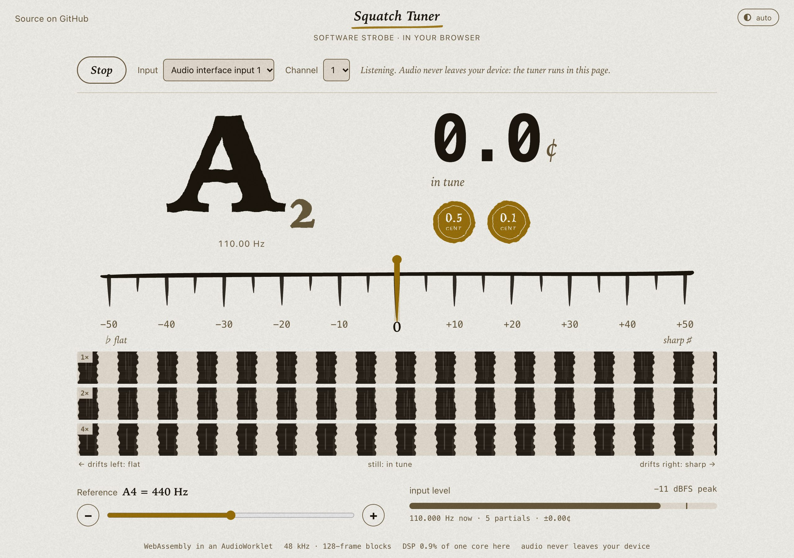
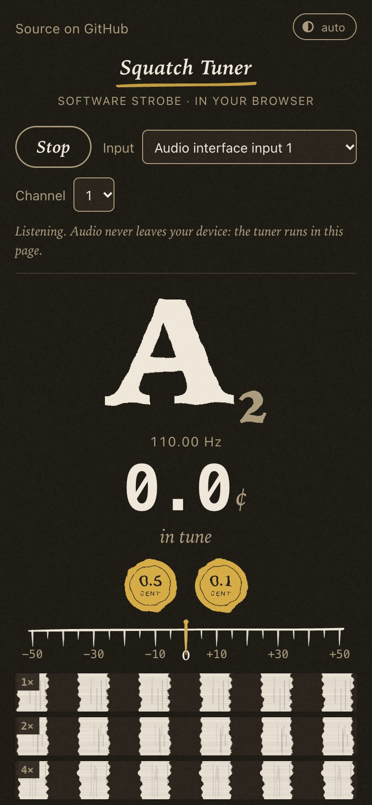
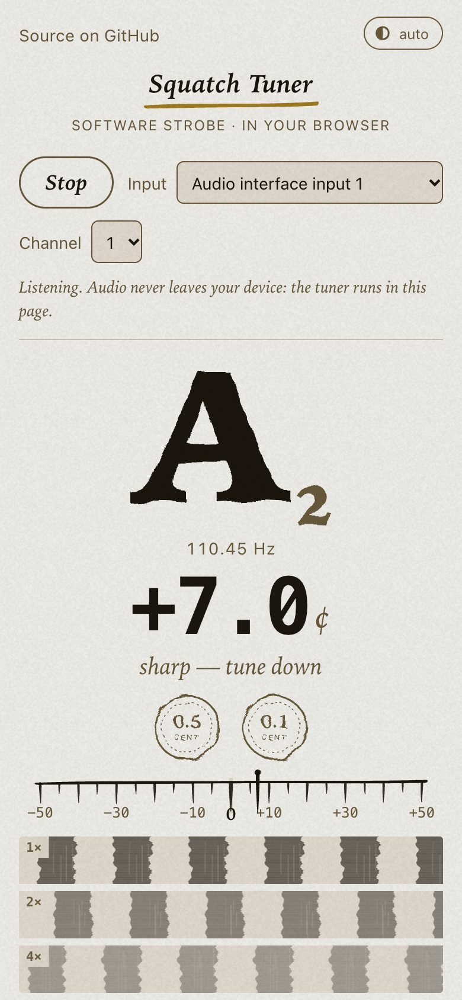
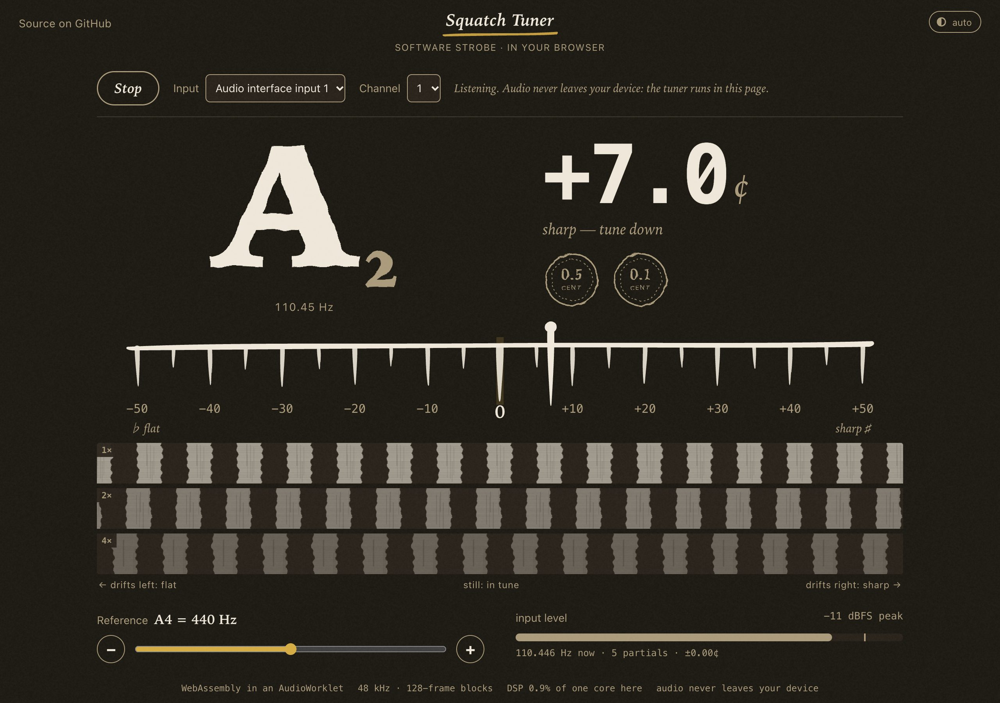

<!-- SPDX-License-Identifier: MIT -->
# Squatch Tuner

A guitar and bass tuner that reads a string to a tenth of a cent. It works like a strobe
tuner, in software: a small, header-only C++17 core with no dependencies, no heap allocation and
no locks in the audio path, so the same code runs in a browser, on a Raspberry Pi and on a
microcontroller.

The tuner core is developed in [squatch-dsp](https://github.com/squatch-stack/squatch-dsp)
(`blocks/tuner`), Squatch Stack's real-time sound engine. This repository is its standalone,
easy-to-embed distribution, plus the browser demo.

**[Try it in your browser](https://squatch-stack.github.io/squatch-tuner/)**: plug in a guitar
or use the microphone. Audio never leaves your device; the tuner runs in the page.



<p>
  
  
  
</p>

## How accurate it is

Every number here was measured, and [RESULTS.md](RESULTS.md) says how, with the raw output in
[`results/`](results/). The comparison runs YIN, MPM (the McLeod Pitch Method) and MPM with a
phase vocoder behind the same front end and gate as the Squatch Tuner.

| | YIN | MPM | MPM + phase vocoder | Squatch Tuner |
|---|---|---|---|---|
| Synthetic plucked string, RMS error | 3.97 c | 1.90 c | 0.036 c | **0.036 c** |
| Fundamental 20 dB down, RMS error | 316 c | 204 c | 204 c | **0.037 c** |
| Clean tone, time to lock within ±0.1 c (median) | 1484 ms | 471 ms | 1457 ms | **44 ms** |
| Real guitar DI re-pitched by exactly 7 c: absolute error, median / p95 | 0.130 / 0.505 c | 0.041 / 0.250 c | 0.058 / 0.293 c | **0.005 / 0.131 c** |

- **Exact tones read exactly.** In this browser demo, test tones at A2, A2 +7 c, E2 −12.5 c and
  E4 +0.3 c are shown as 0.0, +7.0, −12.5 and +0.3 in every sample. On a Raspberry Pi 5 with
  a real audio interface, the steady reading stays within ±0.006 c of the truth (in 52 of 53
  tone runs; one run, straight after a restart, held 0.54 c low and is still unexplained).
- **A plucked string is the limit, not the method.** A string plucked hard starts sharp and
  settles over about half a second: on real recordings the median pitch is +5.2 c at 50 ms
  and +0.9 c at 200 ms. No tuner can read the settled pitch to ±0.1 c in the first ~0.3 s of
  a hard pluck. On real notes, the reading holds within ±1 c of the settled pitch from about
  0.7 s (median) and within ±0.1 c from about 1.2 s.
- **Strum mode is beta.** The polyphonic strum check (`poly.hpp`) reads the four low strings
  of a strum to within 0.3 to 1.9 c, but B3 and E4 are 3 to 8 c out, because their partials
  land on those of the low strings. It needs joint estimation before it can be trusted.
- **Other known failures:** a fretted note with an open string ringing in sympathy, the octave
  of an ambiguous note, and notes decaying into strong hum (withheld, not wrong). All are in
  RESULTS.md.

The real-guitar results use the Guitar-TECHS dataset (Pedroza, Abreu, Corey and Roman, ICASSP
2025, [Zenodo record 14963133](https://zenodo.org/records/14963133), CC BY 4.0). No audio from
it is in this repository: `make results` reads a local copy. Every other test signal is
synthesised by the bench.

**Cost:** 159 ns per 48 kHz sample on an Apple M1 Max, 0.76% of one core. About 1% of one core
in a browser, and 1.0% of one Cortex-A76 core on the Pi. All memory is static: 128 kB for the
tuner.

## How it works

```
input (any rate) -> decimate to ~12 kHz -> history -> MPM every 5.3 ms: which note?
                                       \-> strobe bank, every sample: how far off?
                                             -> stiffness-aware fit -> reading
```

1. **Which note.** MPM finds the period and names the note. Once a note is found it only
   rechecks it, every fourth hop.
2. **How far off.** Each partial of the note is mixed down against a reference at exactly
   that partial's frequency and low-passed by boxcars a whole number of periods long, which
   null every other partial. The drift of each partial's phase is its frequency error, fitted
   by weighted least squares over a sliding window. This is what a strobe disc shows, measured.
3. **Stiff strings.** Real strings are stiff, so partial k sits at k·f0·√(1+Bk²), sharp of
   k·f0. The fit estimates B for each note and reports the fundamental itself. Without this,
   on real recordings, MPM alone reads 2 to 6 c sharp.
4. **Robustness.** A partial that disagrees with the rest (hum, a sympathetic string) is
   dropped, octave slips are caught in both directions, and readings are withheld once a note
   has decayed into the noise.

The display gets two readings: `hz` follows the string, glide included, and drives the strobe;
`steadyHz` is averaged over the window and drives the number and the needle.

## Use the core

The core is header-only: add `include/` to your include path. It never allocates, locks or
makes a system call after `configure()`, and `process()` takes any block size.

```cpp
#include <squatch/tuner/tuner.hpp>

static squatch::tuner::Tuner tuner;   // 128 kB: static or a member, not on the stack

void setup(float sampleRate) {
  squatch::tuner::TunerConfig c;
  c.sampleRate = sampleRate;           // any rate; decimated internally towards 12 kHz
  c.minHz = 38.0f;                     // 27 for a 5-string bass (B0)
  tuner.configure(c);                  // not real-time safe: builds tables
}

void audioCallback(const float* in, int n) {
  tuner.process(in, n);                // real-time safe
  const auto& r = tuner.reading();
  if (r.valid) show(r.midi, r.cents, r.steadyHz, r.strobeTurns);
}
```

- **Naming against A4.** `hosts/common/display.hpp` names the note and the cents against a
  reference pitch chosen at run time (430 to 450 Hz), without touching the audio thread.
- **Handing readings to a display thread.** `include/squatch/dsp/latest.hpp` is a lock-free
  triple buffer: the audio thread publishes, the display takes the newest.
- **Porting.** A Cortex-M7 (Daisy Seed) runs the core as it is. On an ESP32-S3, whose FPU is
  single precision only, the fit's double sums should become float first; RESULTS.md has cycle
  estimates for both. None of these is measured on the target yet.

## Hosts

| Path | What |
|---|---|
| `hosts/wasm/` | the browser demo: the core compiled to WebAssembly (31 kB, no imports) in an AudioWorklet, echo cancellation, noise suppression and automatic gain off, readings to the page 30 times a second |
| `hosts/web/` | the tuner page (strobe, needle, seals, A4 reference, light and dark themes, phone layout), and `serve.py`, a standard-library bridge that streams a live tuner to it |
| `hosts/jack/` | `squatch-tuner-live`, the tuner behind a JACK input (the Pi 5 host in RESULTS.md), and `squatch-tone`, an exact test tone |
| `hosts/common/` | what every host shares: note naming and the reading handoff |

## Build and test

A C++17 compiler and `make`; nothing to download.

```sh
make test          # core tests (ASan + UBSan, including zero heap allocations in process())
                   # and host tests (ThreadSanitizer)
make all           # the tests and the bench programs
make results       # every number in RESULTS.md, about 20 minutes; needs the Guitar-TECHS
                   # recordings: make results GUITAR_TECHS=/path/to/guitar-techs
make live          # the JACK host (Linux, libjack-jackd2-dev)
make demo          # the browser demo into build/web-demo (needs Emscripten)
make demo-test     # the module in Node, then the page in headless Chrome against test tones
make lint          # complexity limits (lizard)
```

To run the demo locally, serve `docs/` over HTTPS or from `localhost`, which browsers also
trust with a microphone: `python3 -m http.server -d docs 8000`, then open
`http://localhost:8000/`.

## Where the code lives

The source of truth is [squatch-dsp](https://github.com/squatch-stack/squatch-dsp), where the
tuner lives in `blocks/tuner/` next to the engine's other blocks and its hosts in `hosts/`.
Everything listed in [`EXPORTED`](EXPORTED) (the core, bench, tests, results, hosts and the
built demo in `docs/`) is written from there by `tools/export-public tuner`, with a SHA-256 per
file and the squatch-dsp commit it came from. CI checks both directions:

- `make verify-export` fails if any exported file was edited here;
- `make check-upstream` fails if this copy differs from squatch-dsp's main branch.

The README, licence, Makefile and CI are this repository's own.

Issues and pull requests are welcome here. A change to an exported file is applied in
squatch-dsp and comes back with the next export. Commit messages here carry no Co-Authored-By
trailers, and commit dates are in UTC (`TZ=UTC git commit`).

## Support this work

If the tuner is useful to you, you can support its development through
[GitHub Sponsors](https://github.com/sponsors/squatchlr).

<!-- Other ways to support, to add when the accounts exist:
  - Patreon
  - Ko-fi
  - Buy Me a Coffee
  - Liberapay
  - Open Collective
  Also uncomment the matching lines in .github/FUNDING.yml. -->

## Licence

MIT, © 2026 Squatch Stack. See [LICENSE](LICENSE).
